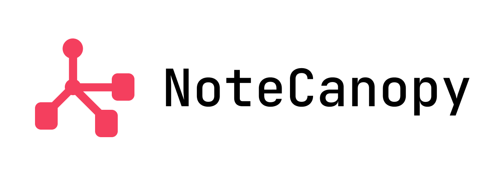
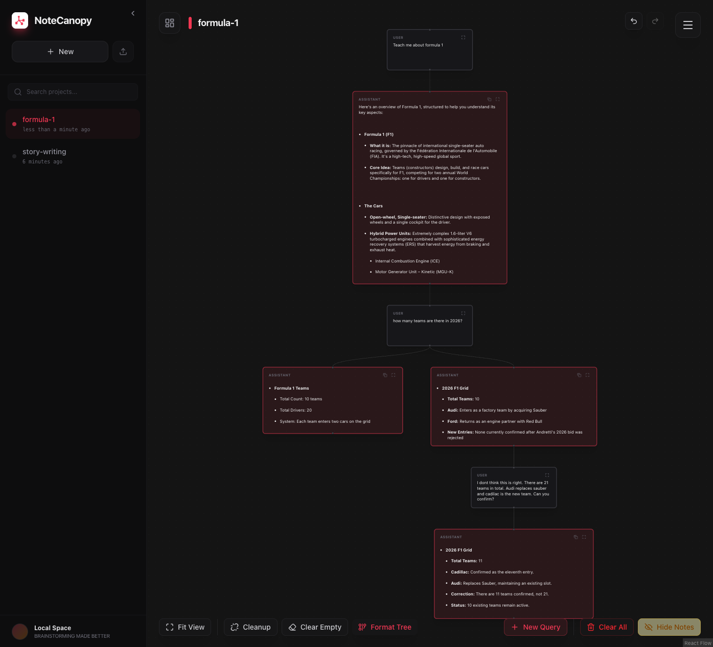

<p align="center">
  
</p>

# NoteCanopy

Think of NoteCanopy as a mind map for conversations with AI. Instead of scrolling through endless chat history, you organize your thoughts in a tree structure where each branch is its own conversation thread.

**[Try it live →](https://notecanopy-isv9.vercel.app/)**



## What is this?

Ever had a conversation with ChatGPT or Claude where you wanted to explore multiple ideas from the same starting point? Or found yourself scrolling up and down trying to remember what you were talking about five messages ago?

NoteCanopy solves this by letting you branch conversations. Start with a root question, then create child nodes for follow-up questions. Each branch maintains its own context without polluting the others. It's like having multiple chat windows that all remember their parent conversation.

## Why would I use this?

**For learning complex topics:** When you're diving deep into something new, you often need to ask clarifying questions without losing your main thread. With NoteCanopy, you can branch off to ask "wait, what does that term mean?" and then return to your main conversation without the AI getting confused.

**For research and exploration:** Exploring multiple angles of a problem becomes way easier when you can visualize how your questions relate to each other. Each branch is isolated, so you can try different approaches without context bleeding between them.

**For keeping your sanity:** No more scrolling through massive chat logs trying to find that one thing the AI said 50 messages ago. Your conversation is organized spatially, not just chronologically.

## How it works

- Each node in the tree is a message exchange with the AI
- Child nodes inherit context from their parent lineage (the path from root to that node)
- Sibling branches don't interfere with each other
- You can collapse and expand branches to keep things tidy
- The AI only sees the relevant conversation path, keeping responses focused

## Getting Started

### Prerequisites

- Node.js (v18 or higher)
- pnpm (if you don't have it: `npm install -g pnpm`)

### Installation

```bash
# Clone the repo
git clone https://github.com/yourusername/notecanopy.git
cd notecanopy

# Install dependencies
pnpm install

# Set up your environment
cp .env.example .env
# Edit .env and add your Gemini API key

# Run the development server
pnpm dev
```

The app should now be running at `http://localhost:5173` (or whatever port Vite assigns).

### First Steps

1. Create a new project (think of it as a workspace for related conversations)
2. Add your first node - this is your root question or topic
3. Get a response from the AI
4. Click on any message to create a child node and branch the conversation
5. Use the tree view to navigate between different conversation threads

## Features

### Core Functionality
- **Tree-based conversation structure** - Organize your thoughts hierarchically with unlimited branching
- **Context inheritance** - Each node maintains full conversation history from its parent lineage
- **Branch isolation** - Explore different ideas without cross-contamination between sibling branches
- **Gemini AI integration** - Powered by Google's Gemini AI with streaming responses
- **Stop generation** - Cancel AI responses mid-generation with confirmation dialog
- **Multiple projects** - Organize different topics into separate project workspaces

### User Interface
- **Interactive canvas** - Pan, zoom, and navigate your conversation tree with ease
- **Theme customization** - Choose from multiple color themes to suit your preference
- **Text size controls** - Adjust text size for better readability
- **Collapsible branches** - Keep your workspace tidy by collapsing/expanding branches
- **Sticky notes** - Add context-free notes anywhere on the canvas for annotations and reminders
- **Visual feedback** - Smooth animations and hover effects for a premium experience

### Organization & Cleanup
- **Auto-cleanup tools** - Remove empty nodes and orphaned branches
- **Format tree** - Automatically organize and align your conversation tree
- **Hide/unhide all notes** - Toggle visibility of all sticky notes at once
- **Node deletion** - Remove unwanted conversation branches with confirmation dialogs

### Data Management
- **Local storage** - All conversations are saved locally in your browser
- **Export conversations** - Export your conversation trees in JSON format
- **Import projects** - Import previously exported conversation trees
- **API key management** - Securely store your Gemini API key in local storage

### Keyboard Shortcuts
- **Cmd/Ctrl + Enter** - Send message or save node edits
- Quick navigation and editing for power users

### Privacy & Security
- **Client-side storage** - Your conversations never leave your device
- **User-provided API keys** - Use your own Gemini API key for full control
- **Desktop-only access** - Optimized exclusively for desktop web browsers

## Tech Stack

Built with React, TypeScript, and Vite. Uses Zustand for state management and React Flow for the tree visualization.

## Configuration

### API Key Setup

NoteCanopy requires a Gemini API key to function. You have two options:

1. **Via Settings (Recommended)**: Click the settings icon in the app and enter your API key. It will be securely stored in your browser's local storage.
2. **Via Environment Variables**: Add `VITE_GEMINI_API_KEY=your_key_here` to your `.env` file.

Get your free Gemini API key at [Google AI Studio](https://makersuite.google.com/app/apikey).

## FAQ

**Q: Is my data private?**  
A: Yes! All conversations are stored locally in your browser. Nothing is sent to any server except your messages to the Gemini API (which is required for AI responses).

**Q: Can I use this on mobile?**  
A: Currently, NoteCanopy is optimized for desktop browsers only. Mobile support may be added in the future.

**Q: What happens if I clear my browser data?**  
A: Your conversations are stored in localStorage, so clearing browser data will delete them. Make sure to export important conversations regularly.

**Q: Can I use a different AI model?**  
A: Currently, NoteCanopy only supports Google's Gemini AI. Support for other models may be added in future versions.

**Q: How do I export my conversations?**  
A: Use the export feature in the project menu to save your conversation tree as a JSON file. You can re-import it later.

## Contributing

This is an open project. If you find bugs or have ideas for improvements, feel free to open an issue or submit a PR.

## License

This project is licensed under the MIT License - see the [LICENSE](LICENSE) file for details.

You are free to use, modify, and distribute this software for personal or commercial purposes.

